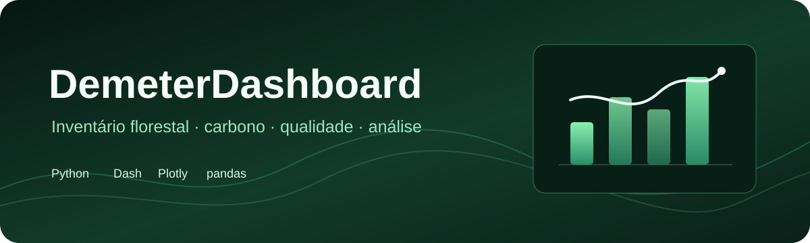

<p align="center">
  
</p>

<h1 align="center">DemeterDashboard</h1>

<p align="center">
  Painel técnico para explorar inventários florestais, estrutura, carbono, qualidade e anomalias.
</p>

<p align="center">
  <code>Python</code> · <code>Dash</code> · <code>Plotly</code> · <code>pandas</code> · <code>scikit-learn</code>
</p>

## Visão geral

O DemeterDashboard transforma arquivos tabulares de inventário em uma experiência
analítica navegável. O pipeline padroniza colunas, valida dados, calcula métricas
florestais e apresenta resultados em gráficos e tabelas interativas.

## Capacidades

- importação de CSV e planilhas;
- normalização de aliases e validação de esquema;
- métricas de estrutura, diversidade e importância de espécies;
- classes diamétricas e indicadores de qualidade;
- estimativas de carbono e CO2 equivalente claramente identificadas;
- detecção de anomalias para apoio à revisão dos registros;
- módulos de crescimento, clima e análise espacial;
- exportação em CSV, XLSX e HTML;
- interface responsiva com navegação por camadas de detalhe.

## Executar localmente

Requer Python 3.11 ou superior.

```bash
python -m venv .venv

# Windows
.venv\Scripts\python -m pip install -r requirements.txt
.venv\Scripts\python app.py
```

Abra `http://127.0.0.1:8051`.

No Windows, `ABRIR_DEMETER.bat` prepara a execução usando o ambiente local.

## Testes

```bash
.venv\Scripts\python -m pip install -r requirements-dev.txt
.venv\Scripts\python -m pytest -q
```

Os testes cobrem o pipeline de preparação, métricas, carbono, detecção de
anomalias e renderização das áreas analíticas principais.

## Dados demonstrativos

Os arquivos em `data/` são exemplos para reprodução local. Antes de usar dados
reais, revise o dicionário, unidades, área amostral e premissas dos cálculos.

O painel apoia exploração e controle de qualidade. Ele não substitui inventário
de campo, responsabilidade técnica, certificação ou metodologia oficial de
quantificação de carbono.

## Estrutura

```text
app.py          aplicação Dash e composição da interface
demeter/        domínio, métricas, validação, gráficos e exportação
assets/         identidade visual e estilos
data/           modelos e dados demonstrativos
tests/          verificações do pipeline e da interface
packaging/      inicialização da distribuição desktop
```

## Autoria e uso

Desenvolvimento: **Marcello Portela**.

O código é disponibilizado para avaliação técnica e portfólio. Consulte
[`NOTICE.md`](NOTICE.md) antes de reutilizar ou redistribuir o projeto.
